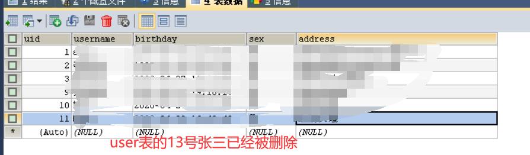
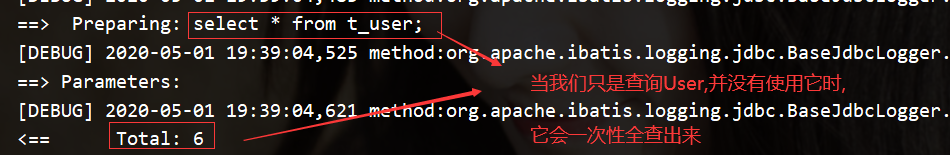
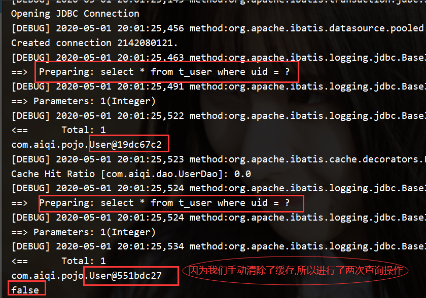

[TOC]
#Mybatis笔记
## 一、简介
[中文文档](https://mybatis.org/mybatis-3/zh/)
>传统上Java与MySql的连接是用JDBC协议的。
>它的弊端：①性能太低 ②sql有关代码写在了Java中，万一java文件中的sql语句需要修改就得重新打包编译。
>解决方法：Mybatis框架。
>ORM框架：Object Relational Mapping 对象关系映射  用于实现面向编程语言里不同类型系统的数据之间的转换。

**环境：**

- JDK1.8
- Mysql 5.6
- maven 3.3.9
- IDEA 2019

**在此之前需要掌握：**

- JDBC
- Mysql
- Java基础
- Maven（看Maven学习教程去吧、六个小时）
- Junit

### 1.1 什么是Mybatis

[百度百科](https://baike.baidu.com/item/MyBatis/2824918?fr=aladdin)

> MyBatis 本是[apache](https://baike.baidu.com/item/apache/6265)的一个**开源**项目[iBatis](https://baike.baidu.com/item/iBatis), 2010年这个项目由apache software foundation 迁移到了google code，并且改名为MyBatis 。2013年11月迁移到Github。
>
> **MyBatis 免除了几乎所有的 JDBC 代码以及设置参数和获取结果集的工作。**
>
> [中文文档](https://mybatis.org/mybatis-3/zh/getting-started.html)

MyBatis是一个Maven项目。

[到这里找它所需要的jar包](https://mvnrepository.com/search?q=mybatis)

- Maven仓库（后面的创建模块会用到）
```xml
<dependency>
    <groupId>org.mybatis</groupId>
    <artifactId>mybatis</artifactId>
    <version>3.5.4</version>
</dependency>
```

- MyBatis 是一款优秀的**持久层框架**，它支持自定义 SQL、存储过程以及高级映射。

- MyBatis 避免了几乎所有的 JDBC 代码以及设置参数和获取结果集的工作。
- MyBatis 可以通过简单的 XML 或注解来配置和映射原始类型、接口和 Java POJO（Plain Old Java Objects，普通老式 Java 对象）为数据库中的记录。

### 1.2 持久化

**数据持久化**	  

 - 就是将程序的数据在持久状态和瞬时状态转化的过程。

 - 内存：断电即失——瞬时
 - 数据库(JDBC)，io文件——持久

**为什么需要持久化**

 - 有一些对象，不能让他丢掉
 - 内存太贵了，还容易丢失。

### 1.3 持久层

 - 层界限十分明显
 - 完成持久化工作的代码块

### 1.4 为什么需要Mybatis

- 方便
- 帮助程序员将数据存入到数据库中。
- 传统的JDBC代码太复杂了。简化，框架。

- 优点

  > 简单易学
  >
  > sql写在xml中，便于统一管理和优化
  >
  > 接触sql与程序代码的耦合
  >
  > sql和代码的分离
  >
  > 提供xml标签，支持编写动态sql
  >
  > **用的人也多**


## 二、第一个Mybatis程序
**思路：搭建环境-->编写代码-->测试！**


###2.1 搭建环境
####2.1.1 搭建数据库
>打开SQLyog软件,创建数据库db_mybatis
>创建表t_user,
>添加几行数据
>sql语句如下
```sql
CREATE DATABASE `db_mybatis`;
USE `db_mybatis`;
CREATE TABLE `t_user` (
  `uid` int(11) NOT NULL AUTO_INCREMENT,
  `username` varchar(32) NOT NULL,
  `birthday` datetime DEFAULT NULL,
  `sex` char(1) DEFAULT NULL,
  `address` varchar(256) DEFAULT NULL,
  PRIMARY KEY (`uid`)
) ENGINE=InnoDB DEFAULT CHARSET=utf8mb4
INSERT INTO `t_user`(`uid`,`username`,`birthday`,`sex`,`address`) VALUES 
(1,'aiqi','1999-09-03 22:04:58','男','湖南省益阳市南县兴盛车站'),
(2,'李昕昊','1999-12-20 06:56:02','男','湖南省益阳市南县北站'),
(3,'吴艺翔','2020-04-27 18:24:58','男','湖南长沙岳麓区')
```
####2.1.2 搭建项目
>打开IDEA,创建一个无骨架的**maven**项目,取名为mybatisLearning
>创建完成后,删除src文件夹,并在其项目下新建一个Module,取名为mybatis01XML
>这样做的原因:把mybatisLearning当作一个父工程，后面会在他下面新建子项目模块，这么做的**目的是直接控制全局的jar包依赖，不用在子模块中捣鼓**

创建完成后,目录结构如下图

####2.1.3 配置xml文件
>1.配置主项目(mybatisLearning)的pom.xml文件
>在pom.xml中添加项目所需要的依赖
```xml
<dependencies>
    <dependency>
        <groupId>org.mybatis</groupId>
        <artifactId>mybatis</artifactId>
        <version>3.5.4</version>
    </dependency>
    <dependency>
        <groupId>mysql</groupId>
        <artifactId>mysql-connector-java</artifactId>
        <version>5.1.6</version>
    </dependency>
    <dependency>
        <groupId>log4j</groupId>
        <artifactId>log4j</artifactId>
        <version>1.2.12</version>
    </dependency>
    <dependency>
        <groupId>junit</groupId>
        <artifactId>junit</artifactId>
        <version>4.13</version>
    </dependency>
</dependencies>
```
>2.创建mybatis-config文件以及配置
>在mybatis01XML子模块的src-->main-->resources文件夹下创建mybatis-config.xml文件
>配置如下
```xml
<?xml version="1.0" encoding="UTF-8" ?>
<!DOCTYPE configuration
        PUBLIC "-//mybatis.org//DTD Config 3.0//EN"
        "http://mybatis.org/dtd/mybatis-3-config.dtd">
<!--configuration核心配置文件-->
<configuration>
    <environments default="development">
        <environment id="development">
            <!--事务管理类型默认是使用JDBC的传输方式-->
            <transactionManager type="JDBC"/>
            <!--配置数据源(连接池)-->
            <dataSource type="POOLED">
                <!--数据库相关的信息-->
                <property name="driver" value="com.mysql.jdbc.Driver"/>
                <property name="url" value="jdbc:mysql://localhost:3306/db_mybatis"/>
                <property name="username" value="root"/>
                <property name="password" value="root"/>
            </dataSource>
        </environment>
    </environments>
</configuration>
```
[看文档中对这部分的描述](https://mybatis.org/mybatis-3/zh/getting-started.html)

每个基于 MyBatis 的应用都是以一个 SqlSessionFactory 的实例为核心的。SqlSessionFactory 的实例可以通过 SqlSessionFactoryBuilder 获得。而 SqlSessionFactoryBuilder 则可以**从 XML 配置文件或一个预先配置的 Configuration 实例来构建出 SqlSessionFactory 实例**。

从 XML 文件中构建 SqlSessionFactory 的实例非常简单，建议使用类路径下的资源文件进行配置。 但也**可以使用任意的输入流（InputStream）实例**，比如用文件路径字符串或 file:// URL 构造的输入流。

```java
String resource = "mybatis-config.xml";
InputStream inputStream = Resources.getResourceAsStream(resource);
SqlSessionFactory sqlSessionFactory = new SqlSessionFactoryBuilder().build(inputStream);
```

**XML 配置文件中**包含了对 **MyBatis 系统的核心设置**，包括获取数据库连接实例的数据源（DataSource）以及决定事务作用域和控制方式的事务管理器（TransactionManager）。

注：也可以不用XML构建SqlSessionFactory，这里就不展示了，具体的见[官方说明文档](https://mybatis.org/mybatis-3/zh/getting-started.html)

>3.配置log4j.properties,用来打印日志,
>具体配置百度


###2.2 编写代码
####2.2.1 创建实体类
>在mybatis01XML下的src-->main-->java下,
>创建com.aiqi.pojo包
>在pojo包下创建**User**实体类,并**实现序列化接口**

```java
package com.aiqi.pojo;

import java.io.Serializable;
import java.util.Date;

public class User implements Serializable {
    private Integer uid;     //用户id
    private String username;//用户名
    private Date birthday; //出生日期
    private String sex;  //性别
    private String address; //住址
}
```

>右键点击generate或按alt+ins键
>**添加getter和setter方法**
>**重写toString()方法**


####2.2.2 创建DAO接口
>在mybatis01XML下的src-->main-->java下,
>创建com.aiqi.dao包
>在dao包下创建**UserDao**接口

```java
package com.aiqi.dao;

import com.aiqi.pojo.User;
import java.util.List;

/**
 * @description: 用户的持久层接口
 * @author: aiqi
 * @create: 2020-04-26 18:56
 **/
public interface UserDao {
    /*
    * @Description: 查找所有用户,返回用户集合
    * @Param: []
    * @return: java.util.List<com.aiqi.pojo.User>
    **/
    List<User> findAll();
}
```

####2.2.3 创建mapper映射
>在mybatis01XML下的src-->main-->resources下,
>创建mapper文件夹
>在该文件夹下新建**UserDao.xml**(UserMapper.xml)文件

```xml
<?xml version="1.0" encoding="UTF-8"?>
<!DOCTYPE mapper
        PUBLIC "-//mybatis.org//DTD Mapper 3.0//EN"
        "http://mybatis.org/dtd/mybatis-3-mapper.dtd">
<mapper namespace="com.aiqi.dao.UserDao">
    <select id="findAll" resultType="com.aiqi.pojo.User">
		select * from t_user
	</select>
</mapper>
```

>创建完成后,还需在mybatis-config.xml文件里配置下
>注册mapper映射
>tip:除了resource属性外,url属性也能注册,url:统一资源定位符
>协议:主机:端口/路径,所以该值可传一个网络资源,或者本地文件资源
>不过用的最多的还是**resource**

```xml
<mappers>
	<!--用xml配置:resource指定映射配置文件的位置,映射配置文件指的是每个dao独立的配置文件-->
	<mapper resource="mapper/UserDao.xml"></mapper>
</mappers>
```


###2.3 测试
>在mybatis01XML下的src-->test-->java下,
>创建com.aiqi.dao包
>在dao包下新建**UserDaoTest**类

```java
package com.aiqi.dao;

import com.aiqi.pojo.User;
import org.apache.ibatis.io.Resources;
import org.apache.ibatis.session.SqlSession;
import org.apache.ibatis.session.SqlSessionFactory;
import org.apache.ibatis.session.SqlSessionFactoryBuilder;

import java.io.InputStream;
import java.util.List;

/**
 * @description: 测试userdao
 * @author: aiqi
 * @create: 2020-04-26 19:50
 **/
public class UserDaoTest {
    /*
     * @Description: mybatis入门案例 mybatis 配置xml开发入门
     * @Param: [args]
     * @return: void
     **/
    public static void main(String[] args) throws Exception {
        // 1.读取配置文件
        String resource = "mybatis-config.xml";
        InputStream inputStream = Resources.getResourceAsStream(resource);
        // 2.构建SqlSessionFactory工厂
        SqlSessionFactory sqlSessionFactory = new SqlSessionFactoryBuilder().build(inputStream);
        // 3.利用工厂生产sqlSession对象
        SqlSession sqlSession = sqlSessionFactory.openSession();
        // 4.使用sqlSession创建dao接口的代理对象
        UserDao userDao = sqlSession.getMapper(UserDao.class);
        // 5.使用代理对象执行方法
        List<User> users = userDao.findAll();
        for (User user:users) {
            System.out.println(user);
        }
        // 6.关闭资源
        sqlSession.close();
        inputStream.close();
    }
}
```
>右键点击run,控制台打印如下,第一个mybatis程序创建成功


>关于SqlSessionFactoryBuilder,SqlSessionFactory,SqlSession,和如何获得Mapper映射对象


##三、Mybatis配置文件解析
  **前文**: mybatis入门的第一个程序已经做完了,做完是做完了,但是还没有理解呀,  在2.1.3中,我们进行了对mybatis-config.xml的配置,那么mybatis-config.xml为什么要那样配置,以及如何配置呢?
  下图为配置项
  


###3.1 environments标签
####3.1.1 environment
```XML
<environments default="development">
  <environment id="development">
    <transactionManager type="JDBC">
      <property name="..." value="..."/>
    </transactionManager>
    <dataSource type="POOLED">
      <property name="driver" value="${driver}"/>
      <property name="url" value="${url}"/>
      <property name="username" value="${username}"/>
      <property name="password" value="${password}"/>
    </dataSource>
  </environment>
</environments>
```

MyBatis 可以配置成适应多种环境，这种机制有助于将 SQL 映射应用于多种数据库之中， 现实情况下有多种理由需要这么做。例如，开发、测试和生产环境需要有不同的配置；或者想在具有相同 Schema 的多个生产数据库中使用相同的 SQL 映射。还有许多类似的使用场景。

**不过要记住：尽管可以配置多个环境，但每个 SqlSessionFactory 实例只能选择一种环境。**

所以，如果你想连接两个数据库，就需要创建两个 SqlSessionFactory 实例，每个数据库对应一个。而如果是三个数据库，就需要三个实例，依此类推，记起来很简单：

- **每个数据库对应一个 SqlSessionFactory 实例**

为了指定创建哪种环境，只要将它作为可选的参数传递给 SqlSessionFactoryBuilder 即可。可以接受环境配置的两个方法签名是：

```java
SqlSessionFactory factory = new SqlSessionFactoryBuilder().build(reader, environment);
SqlSessionFactory factory = new SqlSessionFactoryBuilder().build(reader, environment, properties);
```

如果忽略了环境参数，那么将会加载默认环境，如下所示：

```java
SqlSessionFactory factory = new SqlSessionFactoryBuilder().build(reader);
SqlSessionFactory factory = new SqlSessionFactoryBuilder().build(reader, properties);
```

这个environment就是环境配置中的id号，如果要用默认的environment就要在最开始的地方定义一个default。

- 默认使用的环境 ID（比如：default="development"）。
- 每个 environment 元素定义的环境 ID（比如：id="development"）。
- 事务管理器的配置（比如：type="JDBC"）。
- 数据源的配置（比如：type="POOLED"）。

#### 3.1.2 transactionManager
**事务管理器**

在 MyBatis 中有两种类型的事务管理器（也就是 type="[JDBC|MANAGED]"）：

- JDBC – 这个配置直接**使用了 JDBC 的提交和回滚设施**，它依赖从数据源获得的连接来管理事务作用域。

- MANAGED – 这个配置几乎没做什么。它从不提交或回滚一个连接，而是让容器来管理事务的整个生命周期（比如 JEE 应用服务器的上下文）。 默认情况下它会关闭连接。然而一些容器并不希望连接被关闭，因此需要将 closeConnection 属性设置为 false 来阻止默认的关闭行为。例如:

```xml
<transactionManager type="MANAGED">
	<property name="closeConnection" value="false"/>
</transactionManager>
```

**提示** 如果你正在使用 Spring + MyBatis，则没有必要配置事务管理器，因为 Spring 模块会使用自带的管理器来覆盖前面的配置。

这两种事务管理器类型都不需要设置任何属性。它们其实是类型别名，换句话说，你可以用 TransactionFactory 接口实现类的全限定名或类型别名代替它们。

#### 3.1.3 dataSource
**数据源**

用于连接数据库
比如有dbcp c3p0  druid 

dataSource 元素使用标准的 JDBC 数据源接口来配置 JDBC 连接对象的资源。

- 大多数 MyBatis 应用程序会按示例中的例子来配置数据源。虽然数据源配置是可选的，但如果要启用延迟加载特性，就必须配置数据源。

有三种内建的数据源类型（也就是 type="[**UNPOOLED|POOLED|JNDI**]"）：

**UNPOOLED**– 这个数据源的实现会每次请求时打开和关闭连接。虽然有点慢，但对那些数据库连接可用性要求不高的简单应用程序来说，是一个很好的选择。 性能表现则依赖于使用的数据库，对某些数据库来说，使用连接池并不重要，这个配置就很适合这种情形。UNPOOLED 类型的数据源仅仅需要配置以下 5 种属性：

- `driver` – 这是 JDBC 驱动的 Java 类全限定名（并不是 JDBC 驱动中可能包含的数据源类）。
- `url` – 这是数据库的 JDBC URL 地址。
- `username` – 登录数据库的用户名。
- `password` – 登录数据库的密码。
- `defaultTransactionIsolationLevel` – 默认的连接事务隔离级别。
- `defaultNetworkTimeout` – 等待数据库操作完成的默认网络超时时间（单位：毫秒）。查看 `java.sql.Connection#setNetworkTimeout()` 的 API 文档以获取更多信息。

作为可选项，你也可以传递属性给数据库驱动。只需在属性名加上“driver.”前缀即可，例如：

- `driver.encoding=UTF8`

这将通过 DriverManager.getConnection(url, driverProperties) 方法传递值为 `UTF8` 的 `encoding` 属性给数据库驱动。

**POOLED**– 这种数据源的实现利用“池”的概念将 JDBC 连接对象组织起来，避免了创建新的连接实例时所必需的初始化和认证时间。 **这种处理方式很流行，能使并发 Web 应用快速响应请求。**

除了上述提到 UNPOOLED 下的属性外，还有更多属性用来配置 POOLED 的数据源：

- `poolMaximumActiveConnections` – 在任意时间可存在的活动（正在使用）连接数量，默认值：10
- `poolMaximumIdleConnections` – 任意时间可能存在的空闲连接数。
- `poolMaximumCheckoutTime` – 在被强制返回之前，池中连接被检出（checked out）时间，默认值：20000 毫秒（即 20 秒）
- `poolTimeToWait` – 这是一个底层设置，如果获取连接花费了相当长的时间，连接池会打印状态日志并重新尝试获取一个连接（避免在误配置的情况下一直失败且不打印日志），默认值：20000 毫秒（即 20 秒）。
- `poolMaximumLocalBadConnectionTolerance` – 这是一个关于坏连接容忍度的底层设置， 作用于每一个尝试从缓存池获取连接的线程。 如果这个线程获取到的是一个坏的连接，那么这个数据源允许这个线程尝试重新获取一个新的连接，但是这个重新尝试的次数不应该超过 `poolMaximumIdleConnections` 与 `poolMaximumLocalBadConnectionTolerance` 之和。 默认值：3（新增于 3.4.5）
- `poolPingQuery` – 发送到数据库的侦测查询，用来检验连接是否正常工作并准备接受请求。默认是“NO PING QUERY SET”，这会导致多数数据库驱动出错时返回恰当的错误消息。
- `poolPingEnabled` – 是否启用侦测查询。若开启，需要设置 `poolPingQuery` 属性为一个可执行的 SQL 语句（最好是一个速度非常快的 SQL 语句），默认值：false。
- `poolPingConnectionsNotUsedFor` – 配置 poolPingQuery 的频率。可以被设置为和数据库连接超时时间一样，来避免不必要的侦测，默认值：0（即所有连接每一时刻都被侦测 — 当然仅当 poolPingEnabled 为 true 时适用）。

**JNDI** – 这个数据源实现是为了能在如 EJB 或应用服务器这类容器中使用，容器可以集中或在外部配置数据源，然后放置一个 JNDI 上下文的数据源引用。这种数据源配置只需要两个属性：

- `initial_context` – 这个属性用来在 InitialContext 中寻找上下文（即，initialContext.lookup(initial_context)）。这是个可选属性，如果忽略，那么将会直接从 InitialContext 中寻找 data_source 属性。
- `data_source` – 这是引用数据源实例位置的上下文路径。提供了 initial_context 配置时会在其返回的上下文中进行查找，没有提供时则直接在 InitialContext 中查找。

和其他数据源配置类似，可以通过添加前缀“env.”直接把属性传递给 InitialContext。比如：

- `env.encoding=UTF8`

这就会在 InitialContext 实例化时往它的构造方法传递值为 `UTF8` 的 `encoding` 属性。

你可以通过实现接口 `org.apache.ibatis.datasource.DataSourceFactory` 来使用第三方数据源实现：

```java
public interface DataSourceFactory {
  void setProperties(Properties props);
  DataSource getDataSource();
}
```

org.apache.ibatis.datasource.unpooled.UnpooledDataSourceFactory 可被用作父类来构建新的数据源适配器，比如下面这段插入 C3P0 数据源所必需的代码：

```java
import org.apache.ibatis.datasource.unpooled.UnpooledDataSourceFactory;
import com.mchange.v2.c3p0.ComboPooledDataSource;

public class C3P0DataSourceFactory extends UnpooledDataSourceFactory {
  public C3P0DataSourceFactory() {
    this.dataSource = new ComboPooledDataSource();
  }
}
```

为了令其工作，记得在配置文件中为每个希望 MyBatis 调用的 setter 方法增加对应的属性。 下面是一个可以连接至 PostgreSQL 数据库的例子：

```xml
<dataSource type="org.myproject.C3P0DataSourceFactory">
  <property name="driver" value="org.postgresql.Driver"/>
  <property name="url" value="jdbc:postgresql:mydb"/>
  <property name="username" value="postgres"/>
  <property name="password" value="root"/>
</dataSource>
```

###3.2 mappers标签
**映射器**
既然 MyBatis 的行为已经由上述元素配置完了，我们现在就要来定义 SQL 映射语句了。 但首先，我们需要告诉 MyBatis 到哪里去找到这些语句。 在自动查找资源方面，Java 并没有提供一个很好的解决方案，所以最好的办法是直接告诉 MyBatis 到哪里去找映射文件。 你可以使用相对于类路径的资源引用，或完全限定资源定位符（包括 file:/// 形式的 URL），或类名和包名等。例如：

```xml
<!-- 使用完全限定资源定位符（URL） -->
<mappers>
  <mapper url="file:///var/mappers/AuthorMapper.xml"/>
  <mapper url="file:///var/mappers/BlogMapper.xml"/>
  <mapper url="file:///var/mappers/PostMapper.xml"/>
</mappers>
```

**当我们使用xml开发时,一般使用**

```xml
<!-- 使用相对于类路径的资源引用 -->
<mappers>
  <mapper resource="org/mybatis/builder/AuthorMapper.xml"/>
  <mapper resource="org/mybatis/builder/BlogMapper.xml"/>
  <mapper resource="org/mybatis/builder/PostMapper.xml"/>
</mappers>
```

**当我们使用注解开发时,一般使用**
```xml
<!-- 使用映射器接口实现类的完全限定类名 -->
<mappers>
  <mapper class="org.mybatis.builder.AuthorMapper"/>
  <mapper class="org.mybatis.builder.BlogMapper"/>
  <mapper class="org.mybatis.builder.PostMapper"/>
</mappers>
```

**当映射过多时,可使用**
```xml
<!-- 将包内的映射器接口实现全部注册为映射器 -->
<mappers>
  <package name="org.mybatis.builder"/>
</mappers>
```

###3.3 properties标签

**设置好的属性可以在整个配置文件中用来替换需要动态配置的属性值**


properties 有以下属性
- resource: 指定导入资源的地址
- url: 导入资源的统一资源定位符,可以传入本地文件地址或者网络资源


property有以下属性
- name: 指定变量的名
- value: 指定变量的值

**用法**

```xml
<!-- 导入外部配置属性信息 -->
<properties resource="jdbc.properties"></properties>
```
或
```xml
<!-- 导入外部配置属性信息 -->
<properties>
	<property name="jdbc.driver" value="com.mysql.jdbc.Driver"/>
	<property name="jdbc.url" value="jdbc:mysql://localhost:3306/db_mybatis"/>
	<property name="jdbc.username" value="root"/>
	<property name="jdbc.password" value="root"/>
</properties>11
```
于是dataSource可以写成下面这种
```xml
<dataSource type="POOLED">
    <!--数据库相关的信息-->
    <property name="driver" value="${jdbc.driver}"/>
    <property name="url" value="${jdbc.url}"/>
    <property name="username" value="${jdbc.username}"/>
    <property name="password" value="${jdbc.password}"/>
</dataSource>
```

###3.4 typeAliases标签
**作用**
类型别名可为 Java 类型设置一个缩写名字。 它仅用于 XML 配置，意在降低冗余的全限定类名书写。
**用法**
```xml
<typeAliases>
    <typeAlias alias="Author" type="domain.blog.Author"/>
    <typeAlias alias="Blog" type="domain.blog.Blog"/>
    <typeAlias alias="Comment" type="domain.blog.Comment"/>
    <typeAlias alias="Post" type="domain.blog.Post"/>
    <typeAlias alias="Section" type="domain.blog.Section"/>
    <typeAlias alias="Tag" type="domain.blog.Tag"/>
</typeAliases>
```
当类过多时,可使用package标签,用法如下:
```xml
<typeAliases>
    <package name="domain.blog"></package>
</typeAliases>
```
###3.5 settings标签
**描述**
  **这是 MyBatis 中极为重要的调整设置，它们会改变 MyBatis 的运行时行为**
**各项设置**


更多设置可以去**[官网](https://mybatis.org/mybatis-3/zh/configuration.html#settings)**看
**用法**
例如要开启mybatis的二级缓存
```xml
<settings>
    <!--开启二级缓存（全局缓存）-->
    <setting name="cacheEnabled" value="true"/>
</settings>
```
###3.6更多配置
去官网看  **[官网地址](https://mybatis.org/mybatis-3/zh/configuration.html)**

##四、Mapper映射配置文件


###4.1 出现的问题

  >- 在父工程下创建Module子模块mybatis02,我们复制mybatis01的src文件粘贴替换到mybatis02中
  >- 数据库表和字段保持不变,将User实体类的属性修改下,然后修改下getter,setter和toString
```java
package com.aiqi.pojo;

import java.io.Serializable;
import java.util.Date;

public class User implements Serializable {
    private Integer userId;
    private String userName;
    private Date userBirthday;
    private String userSex;
    private String userAddress;
    //getter,setter,toString略
}
```
>- 执行测试类UserDaoTest后,控制台打印 

  

>为什么会出现为null的情况呢?userName为什么又能打印出来呢?
>这是因为属性名（实体类）和字段名（数据库）不一致的问题。而实体类的userName和数据库的username,mybatis在windows系统下结果映射集不区分大小写

###4.2 解决方案
####4.2.1 傻子式取别名
>此法简单，但是并不能一劳永逸，不太精明

```xml
<select id="findAll" resultType="com.aiqi.pojo.User">
	select uid as userId,username as userName,birthday as userBirthday,sex as userSex,address as userAddress from t_user;
</select>
```
####4.2.2 结果映射集ResultMap
>让User中的属性和数据库中的字段（列属性）一一对应

返回类型不是User实体类了，而是用resultMap（map）代替，并在UserMapper.xml中加上映射集

[结果映射文档](https://mybatis.org/mybatis-3/zh/sqlmap-xml.html)
```xml
<resultMap id="userMap" type="com.aiqi.pojo.User">
    <!--cloumn数据库中的字段，property实体类中的属性,要一 一对应-->
    <!-- id为主键(唯一标识) id 元素对应的属性会被标记为对象的标识符-->
    <id column="uid" property="userId"/>  
    <result column="username" property="userName"/>
    <result column="birthday" property="userBirthday"/>
    <result column="sex" property="userSex"/>
  	<result column="address" property="userAddress"/>
</resultMap>

<select id="findAll" resultMap="userMap">
	select * from mybatis.user where id=#{id}
</select>
```
注意，要返回不再是resultType而是resultMap。

个人觉得官网说的很清楚了


###4.3 select
>查询语句是 MyBatis 中最常用的元素之一——光能把数据存到数据库中价值并不大，还要能重新取出来才有用，多数应用也都是查询比修改要频繁。 MyBatis 的基本原则之一是：在每个插入、更新或删除操作之间，通常会执行多个查询操作。因此，MyBatis 在查询和结果映射做了相当多的改进。一个简单查询的 select 元素是非常简单的。比如：
```xml
<select id="findByUid" parameterType="int" resultType="User">
  SELECT * FROM t_user WHERE uid = #{uid}
</select>
```
>这个语句名为 findByUid，接受一个 int（或 Integer）类型的参数，并返回一个 User 类型的对象，其中的键是列名，值便是结果行中的对应值。

>注意参数符号：#{uid}  里面传什么值无所谓,它只代表一个占位符,即预编译sql的 ?
>
>更多属性去官网查

###4.4 insert, update 和 delete
>数据变更语句 insert，update 和 delete 的实现非常接近,下面为示例语句
```xml
<insert id="insertAuthor">
  insert into Author (id,username,password,email,bio)
  values (#{id},#{username},#{password},#{email},#{bio})
</insert>
<update id="updateAuthor">
  update Author set
    username = #{username},
    password = #{password},
    email = #{email},
    bio = #{bio}
  where id = #{id}
</update>
<delete id="deleteAuthor">
  delete from Author where id = #{id}
</delete>
```
> 下面是它们的属性


###4.5 sql标签
>作用:这个元素可以用来定义可重用的 SQL 代码片段，以便在其它语句中使用。
>用法:

```xml
<!-- sql标签用于抽取重复的sql代码片段 -->
<sql id="searchUser">
select * from t_user   <!-- 注意后面不要+分号 因为该代码片段后面还要拼接sql语句的-->
</sql>

<!-- 查询所有用户 -->
<select id="findAll" resultType="com.aiqi.pojo.User">
	<!--select * from t_user;-->
	<!-- 可用include导入重复sql代码片段 -->
	<include refid="searchUser"></include>
</select>

<!-- 通过用户id进行查询 -->
<select id="findByUid" parameterType="Integer" resultType="com.aiqi.pojo.User">
	<!--select * from t_user where uid = #{uid}-->
	<include refid="searchUser"></include> where uid = #{uid}
</select>
```

###4.6 ResultMap
> 因为前面出现的问题,我们已经初步了解了结果映射ResultMap,其他配置将在后面一 一了解与使用

###4.7 其他配置
> **见官网**

##五、单表CRUD
>环境搭建
>新建mybatis03CRUD子模块,复制mybatis01的src文件到03中,并粘贴替换

###5.1  查select
>- 在UserDao接口中,添加查找方法
```java
/*
* @Description: 查找所有用户,返回用户集合
* @Param: []
* @return: java.util.List<com.aiqi.pojo.User>
**/
List<User> findAll();

/*
* @Description: 根据用户id查询用户信息
* @Param: [uid]
* @return: com.aiqi.pojo.User
**/
User findByUid(Integer uid);

/*
* @Description: 根据用户名关键词进行对用户的模糊查询
* @Param: [keyword]
* @return: java.util.List<com.aiqi.pojo.User>
**/
List<User> findByFuzzyName(String keyword);

/*
* @Description: 查询用户总数
* @Param: []
* @return: int
**/
int findUserTotal();
```
>- 修改mapper/UserDao.xml文件,添加下面的语句

```xml
<!-- 查询所有用户 -->
<select id="findAll" resultType="com.aiqi.pojo.User">
	select * from t_user;
</select>

<!-- 通过用户名进行模糊查询 -->
<select id="findByFuzzyName" parameterType="string" resultType="com.aiqi.pojo.User">
	select * from t_user where username like #{keyword}
<!--模糊查询第二种方法:(其中值必须写'value') 这个方法在开发中很少用,因为这个执行的sql
语句是将sql拼接起来 即 like '%xxx%',而上面那种方法执行的sql是预处理语句,即 like ?-->
<!--select * from t_user where username like '%${value}%'-->
</select>

<!-- 通过用户id进行查询 -->
<select id="findByUid" parameterType="Integer" resultType="com.aiqi.pojo.User">
	select * from t_user where uid = #{uid}
</select>

<!-- 查询用户总数 -->
<select id="findUserTotal" resultType="Integer">
	select count(uid) from t_user
</select>
```

>- 测试一下:修改test文件夹下的com.aiqi.dao.UserDaoTest.java文件,进行单元测试,添加查询测试

```java
package com.aiqi.dao;

import com.aiqi.pojo.User;
import com.aiqi.pojo.vo.UserVO;
import org.apache.ibatis.io.Resources;
import org.apache.ibatis.session.SqlSession;
import org.apache.ibatis.session.SqlSessionFactory;
import org.apache.ibatis.session.SqlSessionFactoryBuilder;
import org.junit.After;
import org.junit.Before;
import org.junit.Test;

import java.io.InputStream;
import java.util.Date;
import java.util.List;

/**
 * @description: 测试userdao
 * @author: aiqi
 * @create: 2020-04-26 19:50
 **/
public class UserDaoTest {
    private InputStream inputStream = null;
    private SqlSessionFactory sqlSessionFactory = null;
    private SqlSession sqlSession = null;
    private UserDao userDao = null;

    @Before
    public void init() throws Exception{
        // 1.读取配置文件
        String resource = "mybatis-config.xml";
        inputStream = Resources.getResourceAsStream(resource);
        // 2.构建SqlSessionFactory工厂
        sqlSessionFactory = new SqlSessionFactoryBuilder().build(inputStream);
        // 3.利用工厂生产sqlSession对象
        sqlSession = sqlSessionFactory.openSession();
        // 4.使用sqlSession创建dao接口的代理对象
        userDao = sqlSession.getMapper(UserDao.class);
    }

    @After
    public void destroy() throws Exception{
        //关闭资源前提交事务
        sqlSession.commit();
        //6.关闭资源
        sqlSession.close();
        inputStream.close();
    }

    /*
     测试findAll方法
     */
    @Test
    public void findAllTest(){
        // 5.使用代理对象执行方法
        List<User> users = userDao.findAll();
        for (User user : users) {
            System.out.println(user);
        }
    }
    
    /*
     测试findByUid方法
     */
    @Test
    public void findByUidTest(){
        // 5.使用代理对象执行方法
        User user = userDao.findByUid(1);
        System.out.println(user.toString());
    }

    /*
     测试findByFuzzyName方法
     */
    @Test
    public void findByFuzzyNameTest(){
        // 5.使用代理对象执行方法
        List<User> users = userDao.findByFuzzyName("%吴%");
        for (User user : users) {
            System.out.println(user);
        }
    }

    /*
    测试findUserTotal方法
     */
    @Test
    public void findUserTotalTest(){
        // 5.使用代理对象执行方法
        int total = userDao.findUserTotal();
        System.out.println("用户总数为:"+total);
    }
}
```
>其中部分结果(findByUid)如下,查询成功
>

###5.2 增insert
>- 在UserDao中添加addUser方法
```java
/*
* @Description: 添加用户
* @Param: [user]
* @return: void
**/
void addUser(User user);
```
>- 在UserDao.xml 映射配置文件中添加 insert语句
```xml
<!-- 添加用户的sql -->
<insert id="addUser" parameterType="com.aiqi.pojo.User">
	<!-- 插入数据后获得插入数据的id -->
	<selectKey keyProperty="uid" keyColumn="uid" resultType="Integer" order="AFTER">
		select last_insert_id();
	</selectKey>
	insert into t_user (username,birthday,sex,address)
	value (#{username},#{birthday},#{sex},#{address})
</insert>
```
>- 在UserDaoTest测试类中添加测试方法
```java
/*
测试addUser方法
*/
@Test
public void addUserTest(){
// 5.使用代理对象执行方法
User user = new User();
user.setUsername("张三");
user.setBirthday(new Date());
user.setSex("男");
user.setAddress("湖南长沙");
System.out.println("保存前"+user.getUid());
userDao.addUser(user); //保存操作时通过select last_insert_id() 获取了用户uid
System.out.println("保存后"+user.getUid());
}
```
>- 测试结果如下
>  

###5.3 删delete
>- 在UserDao中添加deleteUser方法
```java
/*
* @Description: 根据uid删除用户
* @Param: [uid]
* @return: void
**/
void deleteUser(Integer uid);
```
>- 在UserDao.xml 映射配置文件中添加 delete语句
```xml
<!-- 通过用户id删除用户 -->
<delete id="deleteUser" parameterType="Integer">
	delete from t_user where uid = #{uid}
</delete>
```
>- 在UserDaoTest测试类中添加测试方法
```java
/*
测试deleteUser方法
*/
@Test
public void deleteUserTest(){
	// 5.使用代理对象执行方法
	userDao.deleteUser(13);
}
```
>- 测试结果如下
>  
>  


###5.4 改update
>- 在UserDao中添加updateUser方法
```java
/*
* @Description: 更新用户信息
* @Param: [user]
* @return: void
**/
void updateUser(User user);
```
>- 在UserDao.xml 映射配置文件中添加 update语句
```xml
<!-- 更新用户信息 -->
<update id="updateUser" parameterType="com.aiqi.pojo.User">
	update t_user
	set username=#{username},birthday=#{birthday},sex=#{sex},address=#{address}
	where uid = #{uid}
</update>
```
>- 在UserDaoTest测试类中添加测试方法
```java
/*
测试updateUser方法
*/
@Test
public void updateUserTest(){
  // 5.使用代理对象执行方法
  User user = userDao.findByUid(1);
  user.setSex("女");
  user.setAddress("湖北武汉");
  userDao.updateUser(user);
}
```
>- 测试结果如下
>  
>  ----------------------------------->>>
>  

###5.5 知识点补充
####5.5.1 模糊查询
```xml
<!-- 通过用户名进行模糊查询 -->
<select id="findByFuzzyName" parameterType="string" resultType="com.aiqi.pojo.User">
	select * from t_user where username like #{keyword}
<!--模糊查询第二种方法:(其中值必须写'value') 这个方法在开发中很少用,因为这个执行的sql
语句是将sql拼接起来 即 like '%xxx%',而上面那种方法执行的sql是预处理语句,即 like ?-->
<!--select * from t_user where username like '%${value}%'-->
</select>
```
从这里又引出#{}和${}的区别,见 **[链接](https://www.cnblogs.com/liaowenhui/p/12217959.html)**

####5.5.2 事务的自动提交
>在测试类的@After中,在执行增删改语句后需要手动提交事务 
>
```java 
//关闭资源前提交事务
sqlSession.commit();
```

>那么能不能自动提交呢,这是可以的,我们回到创建sqlsession的语句
```java
// 3.利用工厂生产sqlSession对象
sqlSession = sqlSessionFactory.openSession();//传入一个true,让事务自动提交
```
>openSession方法他有很多重载方法,其中有openSession(boolean flag),调用这个方法,并传入一个true值,则代表自动提交事务,之后就不用手动提交了~

##六、动态sql

>搭建环境:创建mybatis04DynamicSQL子模块,复制03中的src文件夹到04,并粘贴替换

###6.1 where if
>用法示例:查询满足User条件的用户
>- 在UserDao中添加findByCondition方法
```java
/*
* @Description: 传入user条件查询用户
* @Param: [user]
* @return: java.util.List<com.aiqi.pojo.User>
**/
List<User> findByCondition(User user);
```
>- 在UserDao.xml 映射配置文件中添加 select语句
```xml
<!-- 通过特定条件进行查询(动态sql) -->
<select id="findByCondition" parameterType="com.aiqi.pojo.User" resultType="com.aiqi.pojo.User">
	select * from t_user
	<where>
		<if test="uid!=null">
			and uid = #{uid}
		</if>
        <if test="username!=null">
        	and username = #{username}
        </if>
        <if test="birthday!=null">
        	and birthday = #{birthday}
        </if>
        <if test="sex!=null">
        	and sex = #{sex}
        </if>
        <if test="address!=null">
        	and address = #{address}
        </if>
    </where>
</select>
```
>- 在UserDaoTest测试类中添加测试方法
```java
/*
测试findByCondition方法
*/
@Test
public void findByConditionTest(){
  // 5.使用代理对象执行方法
  User user = new User();
  user.setUid(3);
  user.setUsername("吴艺翔");
  //查询既要满足用户id为3又要满足用户名为吴艺翔的用户
  List<User> users = userDao.findByCondition(user);
  for (User user0 : users) {
  	System.out.println(user0);
  }
}
```
>- 测试结果如下
>  


###6.2 foreach
>用法示例:查询多个uid用户
>我们先在com.aiqi.pojo包下新建一个UserVO类
```java
package com.aiqi.pojo;

import com.aiqi.pojo.User;

import java.util.List;

/**
 * @description: uservo 用户查询条件
 * @author: aiqi
 * @create: 2020-04-27 20:28
 **/
public class UserVO {
    private List<Integer> uids;
    
    public List<Integer> getUids() {
        return uids;
    }

    public void setUids(List<Integer> uids) {
        this.uids = uids;
    }
}
```
>- 在UserDao中添加findInUids方法
```java
/*
* @Description: 通过vo对象的uids集合条件进行查询
* @Param: [vo]
* @return: java.util.List<com.aiqi.pojo.User>
**/
List<User> findInUids(UserVO vo);
```
>- 在UserDao.xml 映射配置文件中添加 select语句
```xml
<!-- 通过vo对象中的用户id集合进行查询(动态sql) -->
<select id="findInUids" parameterType="com.aiqi.pojo.vo.UserVO" resultType="com.aiqi.pojo.User">
	select * from t_user
	<where>
		<if test="uids!=null and uids.size()>0">
			<foreach collection="uids" open="and uid in(" close=")" item="uid" separator=",">
				#{uid} <!-- 要和item参数一致 -->
			</foreach>
		</if>
	</where>
</select>
```
>- 在UserDaoTest测试类中添加测试方法
```java
/*
测试findInUids方法
*/
@Test
public void findInUidsTest(){
    UserVO vo = new UserVO();
    List<Integer> uids = new ArrayList<Integer>();
    uids.add(1);
    uids.add(2);
    vo.setUids(uids);
  	//查询uid为1和2的用户
    List<User> users = userDao.findInUids(vo);
    for (User user : users) {
    	System.out.println(user);
    }
}
```
>- 测试结果如下
>  

###6.3 其他
>其他见官网 **[链接](https://mybatis.org/mybatis-3/zh/dynamic-sql.html)**


##七、多对一和一对多的处理
###7.1 环境搭建
>- 创建mybatis05OneToMany子模块,将01的src文件夹复制粘贴替换到05中
>- 创建t_account 账户表
```sql
USE `db_mybatis`;

/*Table structure for table `t_account` */
DROP TABLE IF EXISTS `t_account`;

CREATE TABLE `t_account` (
  `aid` int(11) NOT NULL AUTO_INCREMENT,
  `uid` int(11) NOT NULL,
  `balance` double NOT NULL,
  PRIMARY KEY (`aid`),
  KEY `uid` (`uid`),
  CONSTRAINT `t_account_ibfk_1` FOREIGN KEY (`uid`) REFERENCES `t_user` (`uid`) ON DELETE CASCADE ON UPDATE CASCADE
) ENGINE=InnoDB DEFAULT CHARSET=utf8mb4;

/*Data for the table `t_account` */
insert  into `t_account`(`aid`,`uid`,`balance`) values (1,1,500),(2,1,1090),(3,2,799);
```
>- 创建Account实体类
```java
package com.aiqi.pojo;

import java.io.Serializable;

/**
 * @description: 账户类
 * @author: aiqi
 * @create: 2020-04-29 00:01
 **/
public class Account implements Serializable {
    private Integer aid;  //账户id
    private Integer uid;  //用户id
    private Double balance;  //余额

    //Accout和User存在多对一关系(在Mybatis相当于一对一):从表应该包含主表的引用对象
    private User user;
    
    //getter,setter,toString方法省略...
}
```
>- 修改User实体类,添加accounts属性,并添加对应的getter和setter
```java
//User和Account存在一对多关系:主表应该包含从表的引用对象集合
private List<Account> accounts;

public List<Account> getAccounts() {return accounts; }

public void setAccounts(List<Account> accounts) {this.accounts = accounts; }
```

>- 创建AccountDao接口
```java
package com.aiqi.dao;

import com.aiqi.pojo.Account;

import java.util.List;

/**
 * @description: 账户类dao接口
 * @author: aiqi
 * @create: 2020-04-29 10:38
 **/
public interface AccountDao {
    /*
    * @Description: 查找所有账户,返回账户集合和其所属用户
    * @Param: []
    * @return: java.util.List<com.aiqi.pojo.Account>
    **/
    List<Account> findAll();
}
```
###7.2 多对一
>账号和用户存在多对一关系,在mybatis中多对一也相当于一对一
>- 编写AccountDao.xml映射文件
```xml
<?xml version="1.0" encoding="UTF-8"?>
<!DOCTYPE mapper
        PUBLIC "-//mybatis.org//DTD Mapper 3.0//EN"
        "http://mybatis.org/dtd/mybatis-3-mapper.dtd">
<mapper namespace="com.aiqi.dao.AccountDao">
    <resultMap id="accountMap" type="com.aiqi.pojo.Account">
        <id property="aid" column="aid"></id>
        <result property="uid" column="uid" ></result>
        <result property="balance" column="balance"></result>
        <!--账号和用户为多对一关系(多个账号属于一个用户,在mybatis中相当于一对一,一个账号属于一个用户)用 association -->
        <!-- 一对一关系映射 一个account对应一个user -->
        <association property="user" column="uid" javaType="com.aiqi.pojo.User">
            <id property="uid" column="uid"></id>
            <result property="username" column="username"></result>
            <result property="birthday" column="birthday"></result>
            <result property="sex" column="sex"></result>
            <result property="address" column="address"></result>
        </association>
    </resultMap>
  	<!--查找所有账户,返回账户集合和其所属用户-->
    <select id="findAll" resultMap="accountMap"> <!--这里要使用resultMap-->
        select a.*,u.* from t_account a,t_user u where a.uid = u.uid
    </select>
</mapper>
```
>- 新建AccountDaoTest测试类进行测试
```java
package com.aiqi.dao;

import com.aiqi.pojo.Account;
import org.apache.ibatis.io.Resources;
import org.apache.ibatis.session.SqlSession;
import org.apache.ibatis.session.SqlSessionFactory;
import org.apache.ibatis.session.SqlSessionFactoryBuilder;
import org.junit.After;
import org.junit.Before;
import org.junit.Test;

import java.io.InputStream;
import java.util.List;

/**
 * @description: 账户dao测试类
 * @author: aiqi
 * @create: 2020-04-29 11:17
 **/
public class AccountTest {
    private InputStream inputStream = null;
    private SqlSessionFactory sqlSessionFactory = null;
    private SqlSession sqlSession = null;
    private AccountDao accountDao = null;

    @Before
    public void init() throws Exception{
        // 1.读取配置文件
        String resource = "mybatis-config.xml";
        inputStream = Resources.getResourceAsStream(resource);
        // 2.构建SqlSessionFactory工厂
        sqlSessionFactory = new SqlSessionFactoryBuilder().build(inputStream);
        // 3.利用工厂生产sqlSession对象
        sqlSession = sqlSessionFactory.openSession(true); //自动提交事务
        // 4.使用sqlSession创建dao接口的代理对象
        accountDao = sqlSession.getMapper(AccountDao.class);
    }

    @After
    public void destroy() throws Exception{
        //6.关闭资源
        sqlSession.close();
        inputStream.close();
    }

    /*
     测试findAll方法
     */
    @Test
    public void findAllTest(){
        // 5.使用代理对象执行方法
        List<Account> accounts = accountDao.findAll();
        for (Account account : accounts) {
            System.out.println(account+"\t"+account.getUser());
        }
    }
}
```
>测试结果如下,成功~
>

###7.3 一对多
>用户和账户存在一对多关系
>- 修改UserDao.xml映射文件
```xml
<?xml version="1.0" encoding="UTF-8"?>
<!DOCTYPE mapper
        PUBLIC "-//mybatis.org//DTD Mapper 3.0//EN"
        "http://mybatis.org/dtd/mybatis-3-mapper.dtd">
<mapper namespace="com.aiqi.dao.UserDao">
	<resultMap id="userMap" type="com.aiqi.pojo.User">
		<id property="uid" column="uid"></id>
		<result property="username" column="username"></result>
		<result property="birthday" column="birthday"></result>
		<result property="sex" column="sex"></result>
		<result property="address" column="address"></result>
		<!--用户和账号为一对多关系(一个用户拥有多个账号)用 collection -->
		<!-- 一对多关系映射 一个user对应多个account -->
		<collection property="accounts" ofType="com.aiqi.pojo.Account">
			<id property="aid" column="aid"></id>
			<result property="uid" column="uid" ></result>
			<result property="balance" column="balance"></result>
		</collection>
	</resultMap>

	<!-- 
	查询所有用户和其下的所有账户(需要查所有用户,哪怕他其下没有账户,所以这里不能用内连接,要用左外连接) 
	-->
	<select id="findAll" resultMap="userMap">
		SELECT u.*,a.aid,a.balance FROM t_user u LEFT OUTER JOIN t_account a ON u.uid = a.uid
	</select>
</mapper>
```
>- 进行测试 ,修改UserDaoTest的测试方法
```java
package com.aiqi.dao;

import com.aiqi.pojo.Account;
import com.aiqi.pojo.User;
import org.apache.ibatis.io.Resources;
import org.apache.ibatis.session.SqlSession;
import org.apache.ibatis.session.SqlSessionFactory;
import org.apache.ibatis.session.SqlSessionFactoryBuilder;
import org.junit.After;
import org.junit.Before;
import org.junit.Test;

import java.io.InputStream;
import java.util.List;

/**
 * @description: 测试userdao
 * @author: aiqi
 * @create: 2020-04-26 19:50
 **/
public class UserDaoTest {
    private InputStream inputStream = null;
    private SqlSessionFactory sqlSessionFactory = null;
    private SqlSession sqlSession = null;
    private UserDao userDao = null;

    @Before
    public void init() throws Exception{
        // 1.读取配置文件
        String resource = "mybatis-config.xml";
        inputStream = Resources.getResourceAsStream(resource);
        // 2.构建SqlSessionFactory工厂
        sqlSessionFactory = new SqlSessionFactoryBuilder().build(inputStream);
        // 3.利用工厂生产sqlSession对象
        sqlSession = sqlSessionFactory.openSession(true);
        // 4.使用sqlSession创建dao接口的代理对象
        userDao = sqlSession.getMapper(UserDao.class);
    }

    @After
    public void destroy() throws Exception{
        //6.关闭资源
        sqlSession.close();
        inputStream.close();
    }

    /*
     测试findAll方法
     */
    @Test
    public void findAllTest(){
        // 5.使用代理对象执行方法
        List<User> users = userDao.findAll();
        for (User user : users) {
            System.out.println(user+"\t"+user.getAccounts());
        }
    }
}
```

>测试结果如下,成功啦~
>

###7.4 知识点总结
>- 关联 - association [多对一或一对一]
>- 集合 - collection [一对多或多对多]
>- javaType & ofType
	javaType 用来指定实体类中属性的类型
	ofType 用来指定映射到List或者集合中的pojo类型，泛型中的约束类型！
>- association和collection有**select**属性,相当于子查询,可以节省sql语句的编写,之后会在**9.1**中讲到

##八、多对多的处理
###8.1 环境搭建

**多对多其实跟一对多差不多**

>- 创建mybatis06ManyToMany子模块,将01的src文件夹复制粘贴替换到06中
>- 创建t_role和t_user_role表
```sql
USE `db_mybatis`;
/*Table structure for table `t_role` */
DROP TABLE IF EXISTS `t_role`;
CREATE TABLE `t_role` (
  `rid` int(11) NOT NULL AUTO_INCREMENT,
  `role_name` varchar(30) NOT NULL,
  `role_desc` varchar(60) DEFAULT NULL,
  PRIMARY KEY (`rid`)
) ENGINE=InnoDB AUTO_INCREMENT=5 DEFAULT CHARSET=utf8mb4;

/*Data for the table `t_role` */
insert  into `t_role`(`rid`,`role_name`,`role_desc`) values (1,'学校董事长','建设学校'),(2,'校长','管理学校'),(3,'院长','管理二级学院'),(4,'辅导员','管理班级');

/*Table structure for table `t_user_role` */
DROP TABLE IF EXISTS `t_user_role`;
CREATE TABLE `t_user_role` (
  `uid` int(11) NOT NULL,
  `rid` int(11) NOT NULL,
  PRIMARY KEY (`uid`,`rid`),
  KEY `rid` (`rid`),
  CONSTRAINT `t_user_role_ibfk_1` FOREIGN KEY (`uid`) REFERENCES `t_user` (`uid`) ON DELETE CASCADE ON UPDATE CASCADE,
  CONSTRAINT `t_user_role_ibfk_2` FOREIGN KEY (`rid`) REFERENCES `t_role` (`rid`) ON DELETE CASCADE ON UPDATE CASCADE
) ENGINE=InnoDB DEFAULT CHARSET=utf8mb4;

/*Data for the table `t_user_role` */
insert  into `t_user_role`(`uid`,`rid`) values (2,2),(2,3),(9,3),(1,4),(10,4),(11,4);
```
>- 创建Role实体类
```java
package com.aiqi.pojo;

import java.io.Serializable;
import java.util.List;

/**
 * @description: 角色类
 * @author: aiqi
 * @create: 2020-04-29 16:03
 **/
public class Role implements Serializable {
    private Integer rid;
    private String roleName;
    private String roleDesc;

    //Role和User具备多对多关系(一个角色可由多个人扮演,一个用户可以有多个角色)
    private List<User> users;
    
    //getter,setter,toString方法省略...
}
```
>- 修改User实体类,添加roles属性,并添加对应的getter和setter
```java
//User和Role具备多对多关系(一个用户可以有多个角色,一个角色可由多个人扮演)
private List<Role> roles;

public List<Role> getRoles() {
	return roles;
}

public void setRoles(List<Role> roles) {
	this.roles = roles;
}
```
>- 创建RoleDao接口
```java
package com.aiqi.dao;

import com.aiqi.pojo.Role;

import java.util.List;

/**
 * @description: 角色接口类
 * @author: aiqi
 * @create: 2020-04-29 16:13
 **/
public interface RoleDao {
    /*
    * @Description: 查找所有角色,及其所属的用户
    * @Param: []
    * @return: java.util.List<com.aiqi.pojo.Role>
    **/
    List<Role> findAll();
}
```

###8.2 编写代码
>- UserDao.xml映射文件
```xml
<resultMap id="userMap" type="com.aiqi.pojo.User">
	<id property="uid" column="uid"></id>
	<result property="username" column="username"></result>
	<result property="birthday" column="birthday"></result>
	<result property="sex" column="sex"></result>
	<result property="address" column="address"></result>
	<!-- 用户和角色为多对多关系 -->
	<collection property="roles" ofType="com.aiqi.pojo.Role">
		<id property="rid" column="rid"></id>
		<result property="roleName" column="role_name" ></result>
		<result property="roleDesc" column="role_desc"></result>
	</collection>
</resultMap>

<!-- 查询所有用户及其所扮演的角色 -->
<!-- 与中间表做左连接查询 -->
<select id="findAll" resultMap="userMap">
	SELECT
        u.*,r.*
    FROM
        t_user u
    LEFT OUTER JOIN
        t_user_role ur
    ON
        u.uid = ur.uid
    LEFT OUTER JOIN
        t_role r
    ON
        ur.rid = r.rid
</select>
```
>- RoleDao.xml映射文件
```xml
<resultMap id="roleMap" type="com.aiqi.pojo.Role">
    <id property="rid" column="rid"></id>
    <result property="roleName" column="role_name" ></result>
    <result property="roleDesc" column="role_desc"></result>
    <!--用户和角色为多对多关系-->
    <collection property="users" ofType="com.aiqi.pojo.User">
        <id property="uid" column="uid"></id>
        <result property="username" column="username"></result>
        <result property="birthday" column="birthday"></result>
        <result property="sex" column="sex"></result>
        <result property="address" column="address"></result>
    </collection>
</resultMap>

<!-- 查询所有角色及其所属的用户 -->
<!-- 与中间表做左连接查询 -->
<select id="findAll" resultMap="roleMap">
        SELECT
            r.*,u.*
        FROM
            t_role r
        LEFT OUTER JOIN
            t_user_role ur
        ON
            r.rid = ur.rid
        LEFT OUTER JOIN
            t_user u
        ON
            ur.uid = u.uid
</select>
```

###8.3 测试
>- 编写测试代码
>  UserDaoTest:
```java
/*
测试findAll方法
*/
@Test
public void findAllTest(){
    // 5.使用代理对象执行方法
    List<User> users = userDao.findAll();
    for (User user : users) {
   	 	System.out.println(user+"\n"+user.getRoles()+"\n");
    }
}
```
>RoleDaoTest:
```java
/*
测试findAll方法
*/
@Test
    public void findAllTest(){
    // 5.使用代理对象执行方法
    List<Role> roles = roleDao.findAll();
    for (Role role : roles) {
    	System.out.println(role+"\n"+role.getUsers()+"\n");
    }
}
```
>- 测试结果

>UserDao.findAll
>  

>RoleDao.findAll
>  

##九、Mybatis缓存
>**前言**: 
> 查询 ： 连接数据库，耗资源
> 一次查询的结果，给他暂存在一个可以直接取到的地方！-->内存 ：缓存
> 我们再次查询相同数据的时候，直接去缓存节省开销

>Mybatis默认定义了两级缓存。
>- 默认情况下，只有一级缓存开启。（sqlSession级别的缓存，即本地缓存）
>- 二级缓存需要手动开启和配置，他是基于namespace级别的缓存。
>- 为了提高扩展性，Mybatis定义了缓存接口Cache。我们可以通过实现Cache接口来定义二级缓存

###9.1 延迟加载和立即加载
>搭建环境:创建mybatis07LazyLoad子模块,复制05OnetoMany的src文件粘贴替换到07中,重新编写Dao接口和Dao.xml映射

>- 什么是延迟加载和立即加载
>     例子:当我们查询用户时,需不需要把它的所有账户也查出来呢,一般是不会的,这是我们就要用到延迟加载,也就是按需加载,当我们需要时才进行查询;而当我们查询账户时是不是应该把它所属的用户也查出来呢,一般是肯定的,这时我们就需要立即加载.
>
>     即**一对多一般延迟加载,多对一 一般立即加载**

>- 如何实现延迟加载
>  1.修改mybatis-config.xml配置文件,添加设置
```xml
<settings>
     <!-- 延迟加载的全局开关 -->
     <setting name="lazyLoadingEnabled" value="true"/>
     <!--每个延迟加载属性会按需加载-->
     <setting name="aggressiveLazyLoading" value="false"/>
</settings>
```
>2.修改UserDao和AccountDao接口,分别添加

```java
public interface UserDao {
    /*
    * @Description: 查找所有用户,返回用户集合(按需查询用户其下拥有的账户)
    * @Param: []
    * @return: java.util.List<com.aiqi.pojo.User>
    **/
    List<User> findAll();

    /*
    * @Description: 根据用户id查询用户信息
    * @Param: [uid]
    * @return: com.aiqi.pojo.User
    **/
    User findByUid(Integer uid);
}
```

```java
public interface AccountDao {
    /*
    * @Description: 查找所有账户,返回账户集合(按需查询账户所属的用户)
    * @Param: []
    * @return: java.util.List<com.aiqi.pojo.Account>
    **/
    List<Account> findAll();

    /*
    * @Description: 通过用户id查询
    * @Param: [uid]
    * @return: java.util.List<com.aiqi.pojo.Account>
    **/
    List<Account> findByUid(Integer uid);
}
```

>3.编写UserDao和AccountDao的xml映射文件

>UserDao.xml
```xml
<mapper namespace="com.aiqi.dao.UserDao">
	<resultMap id="userMap" type="com.aiqi.pojo.User">
		<id property="uid" column="uid"></id>
		<result property="username" column="username"></result>
		<result property="birthday" column="birthday"></result>
		<result property="sex" column="sex"></result>
		<result property="address" column="address"></result>
		<!--用户和账号为一对多关系(一个用户拥有多个账号)用 collection -->
		<!--
			select:查询用户的唯一标识
			column:根据用户id查询账户时所需要传入的值
		-->
		<collection property="accounts" ofType="com.aiqi.pojo.Account" select="com.aiqi.dao.AccountDao.findByUid" column="uid" />
	</resultMap>

	<!-- 查询所有用户(按需查询用户其下拥有的账户) -->
    <select id="findAll" resultMap="userMap">
		select * from t_user;
	</select>

	<!-- 通过用户id进行查询 -->
	<select id="findByUid" parameterType="Integer" resultType="com.aiqi.pojo.User">
		select * from t_user where uid = #{uid}
	</select>
</mapper>
```
>AccountDao.xml
```xml
<mapper namespace="com.aiqi.dao.AccountDao">
    <resultMap id="accountMap" type="com.aiqi.pojo.Account">
        <id property="aid" column="aid"></id>
        <result property="uid" column="uid" ></result>
        <result property="balance" column="balance"></result>
        <!-- 配置一对一关系映射(一个账户对应一个用户),封装user的内容
            select:查询用户的唯一标识
            column:根据id查询用户时所需要传入的值
        -->
        <association property="user" column="uid" javaType="com.aiqi.pojo.User" select="com.aiqi.dao.UserDao.findByUid" />
    </resultMap>
    <!--查询所有账户(按需查询账户所属的用户) -->
    <select id="findAll" resultMap="accountMap">
        select * from t_account
    </select>
    <select id="findByUid" parameterType="Integer" resultType="com.aiqi.pojo.Account">
        select * from t_account where uid = #{uid}
    </select>
</mapper>
```
>知识点:见注释
>补充:Select 嵌套查询,相当于子查询,这个会触发延迟加载

>4.进行测试
>UserDaoTest
```java
/*
测试findAll方法
*/
@Test
public void findAllTest(){
	// 5.使用代理对象执行方法
	List<User> users = userDao.findAll();
//        for (User user : users) {
//            System.out.println(user+"\t"+user.getAccounts());
//        }
}
```
>第一次运行先注释for循环,第二次测试在取消注释,查看延迟加载的体现
>测试结果:
>

>

>AccountDaoTest
>跟UserDaoTest测试过程一样,也看到了延迟加载的体现

###9.2 一级缓存
>搭建环境:创建mybatis08Cache子模块,复制01的src文件粘贴替换到08中
>在UserDao中添加一个findByUid()的方法,同时在映射xml文件中也相应的编写findByUid配置
>编写完成后,在UserDaoTest中进行一级缓存的测试

>首先我们测试缓存是否存在,注释下面的几行语句

```java
/*
测试一级缓存
*/
@Test
public void L1CacheTest(){
    User user1 = userDao.findByUid(1);
    System.out.println(user1);

//            //关闭sqlSession
//            sqlSession.close();
//            //再次开启sqlSession
//            sqlSession = sqlSessionFactory.openSession(true);
//            userDao = sqlSession.getMapper(UserDao.class);

    //此方法可以清空缓存
//    sqlSession.clearCache();

    User user2 = userDao.findByUid(1);
    System.out.println(user2);
    System.out.println(user1==user2);
}
```
>测试结果图:
>

>进行第二次测试 ,手动清除缓存(取消注释)

>一级缓存有两种方法清空,一是关闭当前sqlSession,二是执行clearCache()方法主动清空缓存,
>当然还有第三种,**执行增删改操作会更新缓存**,于是之前的缓存也就没了

>测试结果
>


>- **注：一级缓存默认开启，作用域在一个sqlSession中有用。**

###9.3 二级缓存
>一级缓存的功能太弱鸡了，所以引入了二级缓存，怎么用呢，直接在mapper.xml中加一行<cache/>
>这个标签还可以定义一些很高级的功能。

>- 基于namespace级别的缓存，一个名称空间，对应一个二级缓存。

>  工作机制：①一个会话查询一条数据，这个数据就会被放在当前会话的一级缓存中②会话关闭了一级缓存中的内容被保存到二级缓存中③新的会话查询信息，就可以从二级缓存中获取内容④不同的mapper（基于namespace）查出的数据会放在自己对应的缓存中。（也就是说二级缓存有多个）

>**步骤：**

>1.开启全局缓存——在mybatis-config核心配置中的setting中

```xml
<!--开启二级缓存（全局缓存）-->
<setting name="cacheEnabled" value="true"/>
```

>2.在要使用二级缓存的Mapper.xml中开启二级缓存并定制功能

```xml
<!--在UserDao.xml映射配置下使用二级缓存-->
<!-- 先进先出，6秒一刷，512kb大小，只读 -->
<cache eviction="FIFO"        
        flushInterval="60000" 
       size="512"
       readOnly="true"
/>
```

>3.测试
>新建UserDaoTest2,测试代码如下
```java
package com.aiqi.dao;

import com.aiqi.pojo.User;
import org.apache.ibatis.io.Resources;
import org.apache.ibatis.session.SqlSession;
import org.apache.ibatis.session.SqlSessionFactory;
import org.apache.ibatis.session.SqlSessionFactoryBuilder;
import org.junit.After;
import org.junit.Before;
import org.junit.Test;

import java.io.InputStream;

/**
 * @description: 测试userdao
 * @author: aiqi
 * @create: 2020-04-29 19:50
 **/
public class UserDaoTest2 {
    private InputStream inputStream = null;
    private SqlSessionFactory sqlSessionFactory = null;

    @Before
    public void init() throws Exception{
        // 1.读取配置文件
        String resource = "mybatis-config.xml";
        inputStream = Resources.getResourceAsStream(resource);
        // 2.构建SqlSessionFactory工厂
        sqlSessionFactory = new SqlSessionFactoryBuilder().build(inputStream);
    }

    @After
    public void destroy() throws Exception{
        //6.关闭资源
        inputStream.close();
    }

    /*
    测试二级缓存
     */
    @Test
    public void L2CacheTest(){
            SqlSession sqlSession1 = sqlSessionFactory.openSession(true);
            UserDao userDao1 = sqlSession1.getMapper(UserDao.class);
            User user1 = userDao1.findByUid(1);
            System.out.println(user1);
            sqlSession1.close();

            SqlSession sqlSession2 = sqlSessionFactory.openSession(true);
            UserDao userDao2 = sqlSession2.getMapper(UserDao.class);
            User user2 = userDao2.findByUid(1);
            System.out.println(user2);
            sqlSession2.close();

            System.out.println(user1==user2);

    }
}
```
>执行结果:
>

>虽然是不同的sqlSession但是是在一个Mapper下的，共用一个二级缓存。

>**小结**

>- 只要开启了二级缓存，在同一个Mapper下就有效
>- 所有的数据都会先放在一级缓存中
>- 只有当会话提交，汇总和关闭的时候，才会提交到二级缓存中

>**缓存原理展示**


###9.4 自定义缓存(了解)
> Ehcache是一种广泛使用的开源Java分布式缓存。主要面向通用缓存,Java EE和轻量级容器。它具有内存和磁盘存储，缓存加载器,缓存扩展,缓存异常处理程序,一个gzip缓存servlet过滤器,支持REST和SOAP api等特点。

>- 1.要在程序中使用ehcache，先导入包。

```xml
<!-- https://mvnrepository.com/artifact/org.mybatis.caches/mybatis-ehcache -->
<dependency>
    <groupId>org.mybatis.caches</groupId>
    <artifactId>mybatis-ehcache</artifactId>
    <version>1.2.0</version>
</dependency>
```

>- 2.在Mapper.xml中

```xml
<!--自定义缓存-->
<cache type="org.mybatis.caches.ehcache.EhcacheCache"/>
```

>- 3.再加xml文件

ehcache.xml

```xml
<?xml version="1.0" encoding="UTF-8"?>
<ehcache xmlns:xsi="http://www.w3.org/2001/XMLSchema-instance"
         xsi:noNamespaceSchemaLocation="http://ehcache.org/ehcache.xsd"
         updateCheck="false">
    <!--
       diskStore：为缓存路径，ehcache分为内存和磁盘两级，此属性定义磁盘的缓存位置。参数解释如下：
       user.home – 用户主目录
       user.dir  – 用户当前工作目录
       java.io.tmpdir – 默认临时文件路径
     -->
    <diskStore path="java.io.tmpdir/Tmp_EhCache"/>
    
    <defaultCache
            eternal="false"
            maxElementsInMemory="10000"
            overflowToDisk="false"
            diskPersistent="false"
            timeToIdleSeconds="1800"
            timeToLiveSeconds="259200"
            memoryStoreEvictionPolicy="LRU"/>

    <cache
            name="cloud_user"
            eternal="false"
            maxElementsInMemory="5000"
            overflowToDisk="false"
            diskPersistent="false"
            timeToIdleSeconds="1800"
            timeToLiveSeconds="1800"
            memoryStoreEvictionPolicy="LRU"/>
    <!--
           defaultCache：默认缓存策略，当ehcache找不到定义的缓存时，则使用这个缓存策略。只能定义一个。
         -->
    <!--
      name:缓存名称。
      maxElementsInMemory:缓存最大数目
      maxElementsOnDisk：硬盘最大缓存个数。
      eternal:对象是否永久有效，一但设置了，timeout将不起作用。
      overflowToDisk:是否保存到磁盘，当系统宕机时
      timeToIdleSeconds:设置对象在失效前的允许闲置时间（单位：秒）。仅当eternal=false对象不是永久有效时使用，可选属性，默认值是0，也就是可闲置时间无穷大。
      timeToLiveSeconds:设置对象在失效前允许存活时间（单位：秒）。最大时间介于创建时间和失效时间之间。仅当eternal=false对象不是永久有效时使用，默认是0.，也就是对象存活时间无穷大。
      diskPersistent：是否缓存虚拟机重启期数据 Whether the disk store persists between restarts of the Virtual Machine. The default value is false.
      diskSpoolBufferSizeMB：这个参数设置DiskStore（磁盘缓存）的缓存区大小。默认是30MB。每个Cache都应该有自己的一个缓冲区。
      diskExpiryThreadIntervalSeconds：磁盘失效线程运行时间间隔，默认是120秒。
      memoryStoreEvictionPolicy：当达到maxElementsInMemory限制时，Ehcache将会根据指定的策略去清理内存。默认策略是LRU（最近最少使用）。你可以设置为FIFO（先进先出）或是LFU（较少使用）。
      clearOnFlush：内存数量最大时是否清除。
      memoryStoreEvictionPolicy:可选策略有：LRU（最近最少使用，默认策略）、FIFO（先进先出）、LFU（最少访问次数）。
      FIFO，first in first out，这个是大家最熟的，先进先出。
      LFU， Less Frequently Used，就是上面例子中使用的策略，直白一点就是讲一直以来最少被使用的。如上面所讲，缓存的元素有一个hit属性，hit值最小的将会被清出缓存。
      LRU，Least Recently Used，最近最少使用的，缓存的元素有一个时间戳，当缓存容量满了，而又需要腾出地方来缓存新的元素的时候，那么现有缓存元素中时间戳离当前时间最远的元素将被清出缓存。
     -->
</ehcache>
```

>- 4.用一个类实现一个Cache接口
>  创建工具类MyCache

```java
package com.haonan.utils;

import org.apache.ibatis.cache.Cache;

public class MyCache implements Cache {

    public String getId() {
        return null;
    }

    public void putObject(Object o, Object o1) {

    }

    public Object getObject(Object o) {
        return null;
    }

    public Object removeObject(Object o) {
        return null;
    }

    public void clear() {

    }

    public int getSize() {
        return 0;
    }
}
```

##十、注解开发
>**前言**:在前面的学习中,我们都是用的xml映射配置文件进行开发,而现在注解开发越来越流行,所以本节学习注解开发,注解开发的入门而已嘿嘿,在之后的项目中一般会有编写要求,要求使用xml或者注解开发,一般不建议混着用.

>环境搭建:创建mybatis09Annotation子模块,复制05的src文件粘贴替换到09中
>因为我们不需要mapper.xml文件了,相应的mybatis-config的mappers设置也要改成
```xml
<mappers>
  <!--用注解配置:class指定dao的全类名-->
  <mapper class="com.aiqi.dao.UserDao"></mapper>
  <mapper class="com.aiqi.dao.AccountDao"></mapper>

  <!--dao过多时可使用包配置-->
  <!--<package name="com.aiqi.dao"/>-->
</mappers>
```

###10.1 单表CRUD
**在mybatis中,CRUD操作的注解分别为:@Insert @Select @Update @Delete**

>- 查
```java
/*
* @Description: 通过用户名模糊查询
* @Param: [keyword]
* @return: java.util.List<com.aiqi.pojo.User>
**/
@Select("select * from t_user where username like #{keyword}")
List<User> findByFuzzyName(String keyword);
```

>- 增
```java
/*
* @Description: 添加用户
* @Param: [user]
* @return: void
**/
@Insert("insert into t_user (username,birthday,sex,address) value (#{username},#{birthday},#{sex},#{address})")
void addUser(User user);
```

>- 删
```java
/*
* @Description: 根据uid删除用户
* @Param: [uid]
* @return: void
**/
@Delete("delete from t_user where uid = #{uid}")
void deleteUser(Integer uid);
```

>- 改
```java
/*
* @Description: 更新用户信息
* @Param: [user]
* @return: void
**/
@Update("update t_user set username=#{username},birthday=#{birthday},sex=#{sex},address=#{address} where uid = #{uid}")
void updateUser(User user);
```

> **测试略,没问题,通过**


###10.2 多表操作
####10.2.1 一对多
>- UserDao的findAll方法(延迟加载)
```java
/*
* @Description: 查找所有用户,返回用户集合
* @Param: []
* @return: java.util.List<com.aiqi.pojo.User>
**/
@Select("select * from t_user")
@Results(id = "userMap",
value = {
	@Result(id = true,property = "userId",column = "uid"), //id设为true,规定该表的唯一标识(主键)
	@Result(property = "username",column = "username"), //id默认为false可以不用写
	@Result(property = "birthday",column = "birthday"),
	@Result(property = "sex",column = "sex"),
	@Result(property = "address",column = "address"),
//用户和账户为一对多关系(一个用户可以拥有多个账户),这里使用@Many注解,其中fetchType属性有三个值EAGER,LAZY,DEFAULT,分别是立即查找,按需查找(懒加载),默认
	@Result(property = "accounts",column = "uid",many = 	@Many(select="com.aiqi.dao.AccountDao.findByUid",fetchType = FetchType.LAZY)),
}
)
List<User> findAll();
```
####10.2.2 多对一
>- AccountDao的findAll方法(立即加载)
```java
/*
* @Description: 查找所有账户,返回账户集合
* @Param: []
* @return: java.util.List<com.aiqi.pojo.Account>
**/
@Select("select * from t_account")
@Results(id = "accountMap",value = {
    @Result(id = true,property = "aid",column = "aid"),
    @Result(property = "uid",column = "uid"),
    @Result(property = "balance",column = "balance"),
    //账户和用户为一对一关系(一个账户只属于一个用户),这里使用@One注解,其中fetchType属性有三个值EAGER,LAZY,DEFAULT,分别是立即查找,按需查找(懒加载),默认
    @Result(property = "user",column = "uid",one = 		@One(select="com.aiqi.dao.UserDao.findByUid",fetchType = FetchType.EAGER)),
})
List<Account> findAll();
```

>**补充**:
>- @Results注解的id属性,是用于其他方法使用这个"ResultMap"
>  用法例子:
```java
/*
* @Description: 通过uid查找用户
* @Param: []
* @return: com.aiqi.pojo.User
**/
@Select("select * from t_user where uid = #{uid}")
//@ResultMap(value = {"userMap"})  //当注解属性只有value时可以省略,当数组只有一个元素时,可以省略大括号,如下
@ResultMap("userMap")
User findByUid(Integer uid);
```

###10.3 开启二级缓存
>- 1.在mybatis-config 配置文件中配置下settings-->cacheEnabled=true

>- 2.在需要开启缓存的Dao中开启
>  使用注解@CacheNamespace
>  用例:
```java
@CacheNamespace(blocking = true)  //开启二级缓存
public interface UserDao {
  //...
}
```


##十一、学习总结

###11.1 学习感悟

>- mybatis耗时六天(2020.04.26-2020.05.01)学完,其中四天半学习,一天半写这篇笔记
>
>- 虽然说是学完了,但还只是入门而已,在之后的各种项目中还需加熟练使用
>
>- 对于框架来说,目前的目标是学会使用,但是后期还是要回来了解下底层,这样才能学得更通透

											by aiqi

